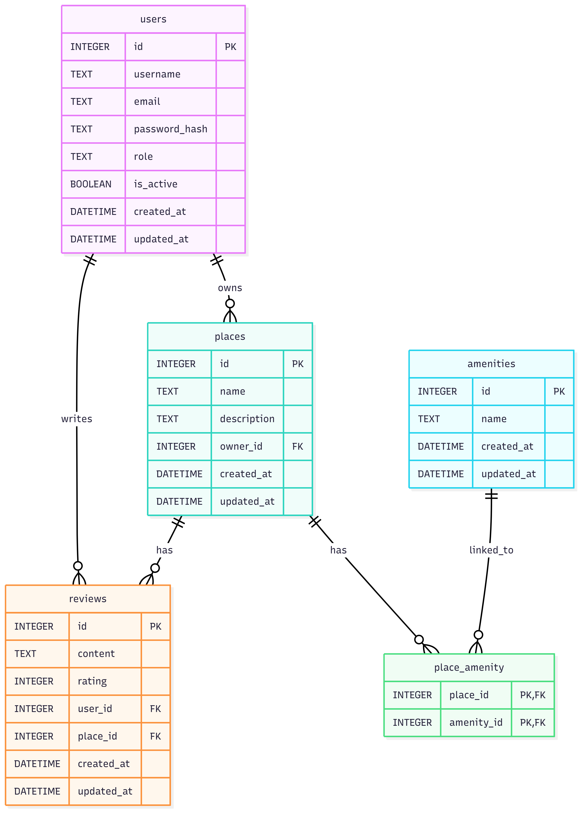
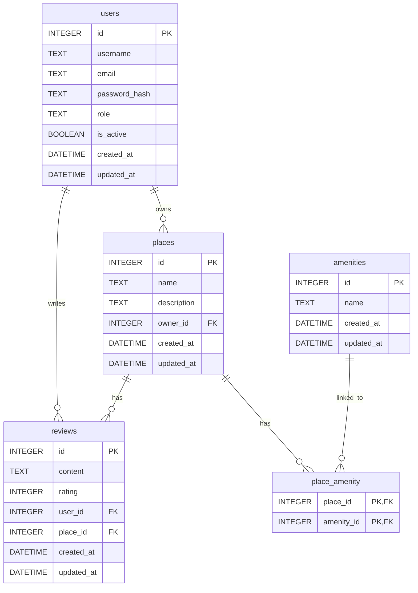

# HBnB - Part 3: Persistence, Authentication & Authorization

This is the third part of the **HBnB project**, where we transition from in-memory storage to a persistent database using **SQLAlchemy**. We also implement user authentication using JWT and secure access control using role-based permissions (`user`, `admin`).

---

## 🚀 Features Implemented

* SQLAlchemy database integration (SQLite)
* JWT-based login and access token authentication
* Role-based authorization (user/admin)
* Secure password storage using bcrypt
* CRUD operations for:

  * Users
  * Places
  * Reviews
  * Amenities
* Database schema generation using raw SQL scripts
* Entity-Relationship diagram for database visualization

---

## 🗂️ Project Structure

```
part3/
├── app/
│   ├── models/
│   ├── repository/
│   ├── facade/
│   ├── routes/
│   ├── settings.py
│   └── main.py
│
├── sql_scripts/
│   ├── 1-schema.sql
│   └── 2-seed.sql
│
├── diagrams/
│   └── er_diagram.mmd
│   └── er_diagram.png
│
├── hbnb.db
└── README.md
```

---

## 🛠️ Setup Instructions

1. Install dependencies:

```bash
pip install -r requirements.txt
```

2. Create and seed the database:

```bash
sqlite3 hbnb.db < sql_scripts/1-schema.sql
sqlite3 hbnb.db < sql_scripts/2-seed.sql
```

3. Run the app:

```bash
export FLASK_APP=app.main
export FLASK_ENV=development
flask run
```

4. Test endpoints (login, CRUD) using Postman or cURL.

---

## 🔐 Admin Credentials (Seeded)

```json
{
  "email": "admin@example.com",
  "password": "admin123"
}
```

Use this to authenticate and receive a JWT token.

---

## 📊 ER Diagram

You can view the entity relationships for the application below:

### Embedded PNG (GitHub-compatible)

> 🖼️ **Place your exported diagram image here**: `part3/diagrams/er_diagram.png`

```markdown

```

Or you can embed it in Markdown directly (if GitHub supports Mermaid rendering):

### Mermaid.js



---

## 📌 Resources

* Flask
* Flask-SQLAlchemy
* Flask-JWT-Extended
* Flask-Bcrypt
* SQLite3
* Mermaid.js

---

## 👩‍💻 Author

Developed by [Marivellisse García Lebrón](https://www.linkedin.com/in/marivellisse-garcia),
as part of Holberton School’s full-stack curriculum.

---

